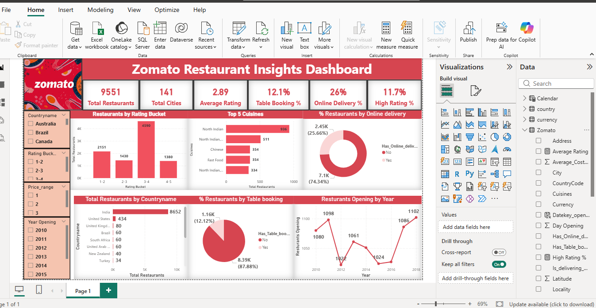

# 🍽️ Zomato Restaurant Insights Dashboard

## 📌 Project Overview
This project presents an interactive Zomato Restaurant Insights Dashboard built using SQL and Power BI.  
It analyzes restaurant data to uncover trends in ratings, cuisines, locations, and service features like online delivery and table booking.

## 📷 Dashboard Preview

## 🎯 Objectives
- Analyze restaurant distribution across cities and countries  
- Identify top cuisines and customer preferences  
- Evaluate restaurant ratings and performance  
- Understand trends in online delivery and table booking  
- Provide interactive insights for better decision-making  

## 🛠️ Tools & Technologies
- SQL – Data extraction, cleaning, and transformation  
- Power BI – Data visualization and dashboard creation  
- Excel / CSV – Data source  

## 📊 Dashboard Features

### 🔹 Key KPIs
- Total Restaurants: 9551  
- Total Cities: 141  
- Average Rating: 2.89  
- Online Delivery: 26%  
- Table Booking: 12.1%  
- High Rating Restaurants: 11.7%  

### 🔹 Visual Insights
- Restaurants by Rating Bucket  
- Top 5 Cuisines  
- Restaurants by Country  
- Online Delivery Distribution  
- Table Booking Analysis  
- Restaurants Opening Trend by Year  

## 🚀 How to Use
1. Clone the repository  
2. Run SQL scripts  
3. Open Power BI file  
4. Explore dashboard  

## 💡 Key Insights
- Majority of restaurants have ratings between 2–3  
- Online delivery available in ~26%  
- Few cuisines dominate the market  
- High-rated restaurants are limited  

## 🔗 Connect with Me
- 💼 [LinkedIn](https://www.linkedin.com/akshata-patil-114260371)
- 💻 [[GitHub](https://github.com/patilakshatab1-lab/Zomato-Analytics-Dashboard))
